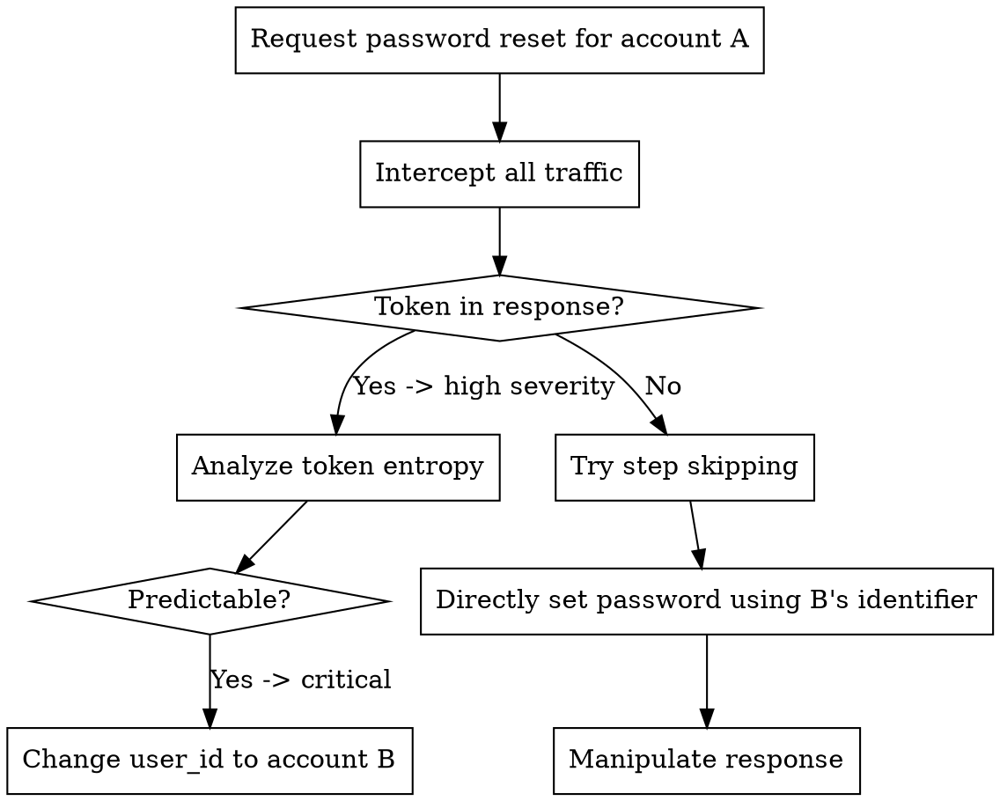

# Authentication Domain

## Overview

Authentication vulnerabilities are entry points. 8,846 WooYun cases, 40% of all findings, prove that most applications fail at the first defensive line.

**Core principle:** Authentication is a chain. Every link must hold: credentials, sessions, reset flows, and verification mechanisms. One weak link equals a full bypass.

## Attack Patterns by Subdomain

### Weak Credentials (7,513 cases, 58.2% high severity)

**Iron rule: test default credentials before any other authentication testing. Weak or default passwords account for 34% of all WooYun cases.**

**Systematic testing checklist:**

```
Phase 1: Default credentials
- [ ] admin/admin, admin/123456, admin/admin123
- [ ] root/root, root/toor, root/password
- [ ] test/test, guest/guest, demo/demo
- [ ] [vendor name]/[vendor name], such as tomcat/tomcat
- [ ] [product name]/[product name]
- [ ] Review vendor documentation for default credentials

Phase 2: Social-engineering passwords
- [ ] Company name (lowercase, initial capital, plus year)
- [ ] Domain name (without TLD, plus numbers)
- [ ] Product name + common suffixes (123, @123, !@#)
- [ ] City name + year (beijing2024)
- [ ] Mobile-number patterns (common in Chinese systems)

Phase 3: Credential stuffing
- [ ] China Top 100 passwords (123456, a123456, 123456789)
- [ ] Global Top 100 passwords
- [ ] Industry-specific default passwords (healthcare, finance, education)

Phase 4: Anti-brute-force bypass
- [ ] CAPTCHA reuse (same session, no refresh)
- [ ] CAPTCHA removal (delete parameter from request)
- [ ] IP rotation (X-Forwarded-For header manipulation)
- [ ] Account enumeration through response differences
- [ ] Rate-limit bypass through distributed requests
```

**Key parameters:** `username`, `password`, `account`, `passwd`, `pwd`, `pass`

### Password Reset (777 cases, 88.0% high severity)

**This is the highest-severity class in the entire WooYun dataset. Treat every password reset flow as vulnerable until proven otherwise.**

**Attack-pattern matrix:**

| Pattern | Test method | WooYun prevalence |
|---------|-------------|-------------------|
| Token in URL/response | Intercept reset response and inspect token | Very high |
| Predictable token | Request multiple resets and analyze token entropy | High |
| Step skipping | Jump directly to the "set new password" step | High |
| User ID manipulation | Change `user_id`/email in reset request | Very high |
| Response manipulation | Change `{"success":false}` to `{"success":true}` client-side | Medium |
| Verification-code reuse | Use the same SMS/email code across different users | Medium |
| Host header injection | Inject attacker domain into the Host header to capture reset link | Medium |
| Timing attack | Infer valid accounts from response-time differences | Low |

**Testing flow:**



### Login Bypass (57 cases, 57.9% high severity)

**Patterns:**
- Login-form SQL injection: `' OR 1=1--`
- Default backdoor accounts (debug/test accounts left in production)
- Authentication logic inversion (checking `if NOT authenticated` instead of `if authenticated`)
- Cookie/token forgery (weak signing or no verification)
- OAuth misconfiguration (`redirect_uri` manipulation, missing `state` parameter)

### CAPTCHA/Verification Bypass (384 cases, 44% high severity)

**Systematic CAPTCHA bypasses:**

| Bypass technique | Test method |
|------------------|-------------|
| No server-side validation | Remove CAPTCHA parameter from the request entirely |
| Reusable CAPTCHA | Submit the same CAPTCHA value multiple times |
| Predictable CAPTCHA | Analyze CAPTCHA generation algorithm |
| OCR-readable CAPTCHA | Simple font, no noise, no rotation |
| Voice CAPTCHA bypass | Apply speech-to-text recognition to the audio option |
| SMS code without expiry | Request a new code, then continue using the old code |
| SMS code without rate limiting | Brute force 4-6 digit SMS codes |
| SMS code shared across users | Use the code sent to phone A for account B |
| Client-side CAPTCHA check | Verify whether CAPTCHA is checked only in JavaScript |

## Real Cases

| Case | Subdomain | Impact |
|------|-----------|--------|
| TCL unified authentication platform vulnerability allowed resetting all user account passwords | Password reset | Full account takeover across N+ business systems |
| Qingting FM public platform arbitrary user password reset | Password reset | Arbitrary user password reset |
| M1905 movie site critical arbitrary password reset, including official account access | Password reset | Official account compromise |
| Duduniu Bailebar password reset flaw exposed data for users from 279 internet cafes | Password reset | 279 internet-cafe user accounts exposed |
| Feite Logistics backend login bypass/SQL injection exposed tens of millions of users, waybills, bank cards, and ID-card photos | Login bypass | 10M+ users, bank cards, ID-card photos |
| Sohu app site login bypass plus SQL injection with root privileges | Login bypass | Database root-level access |
| Galanz vendor collaboration platform authentication bypass led to /root execution and shell access | Authentication bypass | Remote code execution |
| Huaan Insurance site authentication bypass allowed command execution and shell access | Authentication bypass | Remote code execution in insurance system |
| Aika automotive site design logic flaw bypassed CAPTCHA restrictions | CAPTCHA bypass | Enabled brute force |
| Lvmama travel site progressed from CAPTCHA bypass to arbitrary hotel-data export | CAPTCHA bypass | Hotel data leakage |
| Shanghai Airlines employee personal information leakage/password reset via SMS verification bypass/internal document exposure | SMS bypass | Employee personal information + internal documents |

## Defense Patterns (from WooYun remediation data)

### Code Level
- Passwords: bcrypt (cost >= 12), never MD5/SHA1
- Password complexity: minimum 8 characters + uppercase/lowercase + numbers + special characters
- Password history: reject reuse of the last 3 passwords
- Force password change on first login
- Sessions: cryptographically random, HttpOnly, Secure, SameSite
- Reset tokens: at least 32 random bytes, single use, time-limited to 15 minutes
- Verification codes: server-side validation, single use, bound to session

### Architecture Level
- Centralized authentication (SSO/OAuth2/SAML)
- MFA for all privileged operations
- Account lockout: lock after 5 consecutive failures with progressive delay (1s, 2s, 4s, 8s...)
- Rate limiting: separate limits per account and per IP
- Geo-anomaly alerts: notify on login from a new location

### Monitoring
- Login failure spike detection (more than 5 per account per minute)
- Credential-stuffing detection (many accounts, few attempts per account)
- Password reset anomalies (bulk resets from one IP)
- Geo-anomalies (login from a new country)
