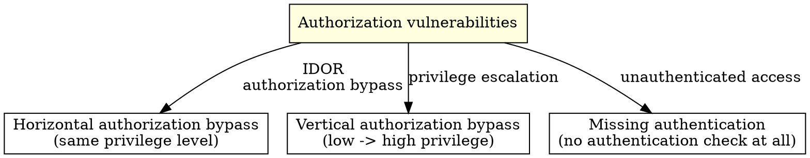

# Authorization Domain

## Overview

Authorization vulnerabilities allow authenticated users to access resources they should not be able to access. 6,269 WooYun cases prove that developers often build authentication but neglect authorization controls.

**Core principle:** Authentication answers "who are you?" Authorization answers "what are you allowed to do?" Most applications handle the first question reasonably well and the second question poorly.

## Attack Pattern Taxonomy



### Horizontal Authorization Bypass / IDOR (1,705+230 cases)

**The easiest vulnerability class to overlook. Scanners cannot find it.**

**Systematic testing protocol:**

```
For every API endpoint that returns user-specific data:

1. Identify resource identifiers
   - URL path: /api/users/{id}/orders
   - Query parameter: /api/orders?user_id=123
   - POST body: {"user_id": 123, "action": "view"}
   - Cookie/header: X-User-Id: 123

2. Prepare two test accounts (account A, account B)
   - Log in as A and record all identifiers
   - Log in as B and record all identifiers

3. Test every CRUD operation
   - [ ] Create: Can A create a resource owned by B?
   - [ ] Read: Can A view B's resource? (most common)
   - [ ] Update: Can A modify B's resource?
   - [ ] Delete: Can A delete B's resource?

4. Test identifier manipulation
   - [ ] Direct ID replacement: 123 -> 124
   - [ ] ID enumeration: iterate across an ID range
   - [ ] Parameter pollution: ?uid=123&uid=456 (server uses last value)
   - [ ] Array injection: uid[]=123 (bypass type checks)
   - [ ] Nested JSON: {"user": {"id": 456}}
   - [ ] Encoded IDs: base64(456), hex(456)
   - [ ] Negative/zero IDs: id=0, id=-1
   - [ ] UUID prediction (if sequential UUIDs are used)
```

**Key parameters:** `user_id`, `uid`, `id`, `order_id`, `file_id`, `account_id`, `tenant_id`, `doc_id`, `msg_id`

**WooYun case pattern:** "A Beijing Hyundai platform allowed authorization-bypass enumeration of all user-uploaded documents, including millions of identity documents, vehicle licenses, invoices, and driver's licenses" - sequential file IDs with no ownership check.

### Vertical Authorization / Privilege Escalation (255+86 cases)

**Testing protocol:**

```
1. Identify privilege levels
   - Anonymous -> registered user -> administrator -> super administrator
   - User roles: buyer, seller, agent, manager

2. Map admin-only endpoints
   - /admin/*, /api/admin/*, /manage/*
   - User management, configuration, reports
   - Discovery sources: JavaScript files, API docs, sitemaps, robots.txt

3. Test with a low-privilege session
   - [ ] Access admin endpoints with a user token
   - [ ] Add admin parameters: role=admin, is_admin=true, level=9
   - [ ] Modify role during registration: {"role": "admin"}
   - [ ] Access admin API with no token at all
   - [ ] Change HTTP method: GET -> POST, POST -> PUT
```

### Unauthenticated Access / Missing Authentication (2,102+1,891 cases)

**The most basic vulnerability: endpoints with no authentication at all.**

**Systematic endpoint discovery:**

| Discovery method | Target |
|------------------|--------|
| Direct URL guessing | /admin, /console, /debug, /status, /api/docs |
| robots.txt / sitemap.xml | Disclosed "forbidden" paths |
| JavaScript source analysis | API endpoints hardcoded in frontend code |
| Error-page information | Stack traces exposing internal paths |
| HTTP method probing | OPTIONS requests may expose endpoints |
| Path traversal variants | /..;/admin, /%2e%2e/admin |

**Testing:**

```
For every discovered endpoint:
1. Access without any authentication headers/cookies
2. If redirected to login -> try adding X-Forwarded-For: 127.0.0.1
3. If 403 -> try alternate HTTP methods (GET/POST/PUT/DELETE/PATCH)
4. If 403 -> try path canonicalization: /admin/ vs /admin vs /Admin
5. If 403 -> try URL encoding: /%61dmin
6. Record: which endpoints have no authentication at all?
```

**WooYun pattern:** 58.2% of unauthenticated access findings involved management backends fully exposed to the internet.

### Arbitrary Operation / Arbitrary-X (529 cases, 51-86% high severity)

**The "permission dimension": operations attackers should not be able to perform on any object.**

This category is different from IDOR. IDOR is about accessing "someone else's" resource. Arbitrary operation is about performing "an operation you should not have," regardless of who owns the resource.

| Subcategory | Case count | High-severity share | Attack pattern |
|-------------|------------|---------------------|----------------|
| Arbitrary account access | 220 | 86.4% | Log in or act as any user without credentials |
| Arbitrary modification | 159 | 63.5% | Modify any record (profile, configuration, content) |
| Arbitrary user registration | 24 | 75.0% | Bypass registration controls (invite-only, admin-only) |
| Arbitrary viewing | 45 | 55.6% | View any record beyond IDOR scope (bulk export, admin view) |
| Arbitrary deletion | 41 | 51.2% | Delete any record without ownership/permission |
| Arbitrary operation | 40 | 72.5% | Execute privileged operations (approve, publish, execute) |

**Testing protocol:**

```
For every write/delete/admin operation:

1. Identify the permission model
   - Who should be allowed to perform this operation?
   - Is the check at the user, role, or object level?

2. Test authorization bypass
   - [ ] Execute the operation as an unprivileged user
   - [ ] Execute the operation on an object not owned by the current user
   - [ ] Execute bulk operations (modify/delete all by API enumeration)
   - [ ] Execute admin-only operations as a normal user (approve, publish)
   - [ ] Self-approval: create a request + approve your own request

3. Test registration controls
   - [ ] Register when registration is "closed" or "invite only"
   - [ ] Register as an admin/elevated role
   - [ ] Bypass email-domain restrictions
   - [ ] Bypass phone verification for registration
```

## Real Cases

| Case | Subdomain | Impact |
|------|-----------|--------|
| Beijing Hyundai platform allowed authorization-bypass enumeration of millions of identity documents, vehicle licenses, invoices, and driver's licenses | IDOR | Millions of identity documents exposed through sequential file IDs |
| FlowerPlus site horizontal authorization flaw affected all users | Horizontal authorization bypass | All user data accessible |
| EMS site horizontal authorization flaw exposed large volumes of user information | Horizontal authorization bypass | Large-scale personal information exposure |
| China Eastern Airlines US website leaked severe order information and had authorization bypass | Vertical authorization bypass | Order data + privilege escalation |
| Wacai authorization bypass allowed login to other user accounts | Vertical authorization bypass | Account takeover |
| Baofeng Mojing site SQL injection exposed 59 tables and the authorization-control database | Vertical authorization bypass | Full database access through injection |
| Sina Leju had multiple ZooKeeper instances without authorization controls, exposing sensitive information | Missing authentication | Internal service exposure |
| China Financial Certification Authority system had unauthenticated access involving intranet information | Missing authentication | Intranet access |
| Open Education site unauthenticated access affected large amounts of student information | Missing authentication | Student personal information exposure |

## Defense Patterns

### Code Level
- **Deny by default:** whitelist public endpoints; everything else requires authentication
- **Ownership validation:** verify `resource.owner_id == current_user.id` on every query
- **ORM-level filtering:** `Model.where(user_id: current_user.id)` - never trust raw IDs
- **Unpredictable IDs:** UUID v4 instead of sequential integers
- **RBAC/ABAC:** role-based or attribute-based access-control framework
- **Separation of duties:** creators cannot approve their own requests

### Architecture Level
- **API gateway:** centralized authorization enforcement point
- **Zero trust:** verify every request regardless of network source
- **Multi-tenant isolation:** database-level `tenant_id` filtering
- **URL pattern protection:** framework-level route authorization (Spring Security, Django permissions)

### Monitoring
- **Cross-user access patterns:** user A accesses many other users' resources
- **Admin endpoint access:** non-admin IP accesses /admin/*
- **ID enumeration detection:** sequential ID requests from a single session
- **Permission-change audit:** all role/permission changes logged
- **Bulk operation detection:** one user modifies/deletes an abnormal number of records
