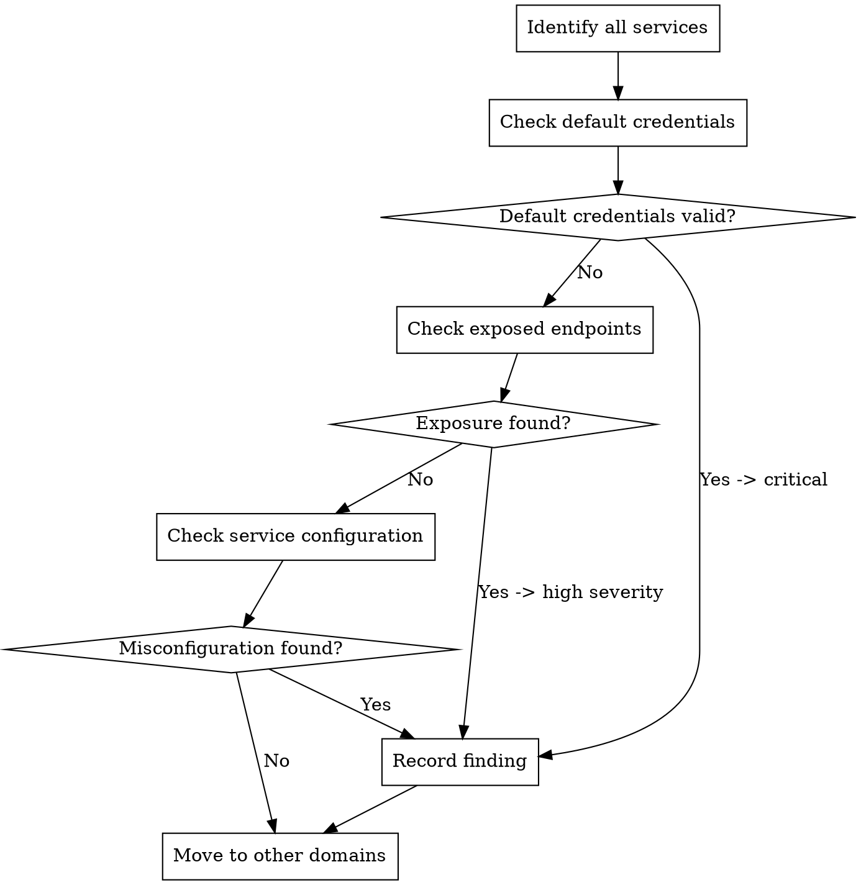

# Configuration Domain

## Overview

Misconfiguration is the easiest vulnerability class to exploit. In 1,796 WooYun cases, 72.6% were high severity, proving that the most destructive intrusions often come from default configuration.

**Core principle:** Every service's default configuration is designed for convenience, not security. If you have not explicitly hardened it, assume it is vulnerable.

## Attack-Pattern Matrix

### Default Credentials (cross-reference weak passwords)

**Service-specific default credential database:**

| Service | Default credentials | WooYun frequency |
|---------|---------------------|------------------|
| Tomcat Manager | tomcat/tomcat, admin/admin | Very high |
| JBoss console | admin/admin, jboss/jboss | Very high |
| WebLogic | weblogic/weblogic1 | High |
| Jenkins | no authentication by default | Very high |
| Zabbix | Admin/zabbix | High |
| phpMyAdmin | root/(empty) | Very high |
| MongoDB | no authentication by default | High |
| Redis | no authentication by default | Very high |
| Elasticsearch | no authentication by default | High |
| Docker Remote API | no authentication by default | High |
| Kubernetes Dashboard | token bypass | Medium |
| Grafana | admin/admin | High |
| RabbitMQ | guest/guest | High |
| ActiveMQ | admin/admin | High |
| Nacos | nacos/nacos | High |
| Spring Boot Actuator | no authentication by default | Very high |
| Hadoop YARN | no authentication by default | High |

### Exposed Management Interfaces

**Systematic discovery:**

```
1. Web management consoles
   - [ ] /manager/html (Tomcat)
   - [ ] /jmx-console (JBoss)
   - [ ] /console (WebLogic, H2, Rails)
   - [ ] /admin (generic)
   - [ ] /jenkins
   - [ ] /zabbix
   - [ ] /grafana
   - [ ] /solr/admin
   - [ ] /nacos
   - [ ] /actuator (Spring Boot)
   - [ ] /druid (Alibaba Druid)

2. Database management
   - [ ] :3306 (MySQL, no password)
   - [ ] :6379 (Redis, no authentication)
   - [ ] :27017 (MongoDB, no authentication)
   - [ ] :9200 (Elasticsearch, no authentication)
   - [ ] :5432 (PostgreSQL, trust authentication)
   - [ ] /phpmyadmin, /pma, /myadmin

3. Deployment/CI tools
   - [ ] :2375 (Docker Remote API, no TLS)
   - [ ] :8080 (Jenkins, no authentication)
   - [ ] :8443 (Kubernetes Dashboard)
   - [ ] :9000 (Portainer, SonarQube)
   - [ ] :8161 (ActiveMQ)
   - [ ] :15672 (RabbitMQ)

4. Monitoring/debugging
   - [ ] /server-status (Apache)
   - [ ] /nginx_status (Nginx)
   - [ ] /debug/pprof (Go)
   - [ ] /actuator/env (Spring, environment-variable leakage)
   - [ ] /actuator/heapdump (Spring, memory leakage)
   - [ ] /trace (request history exposure)
```

### Misconfigured Services

**High-impact misconfiguration patterns:**

| Misconfiguration | Impact | Test method |
|------------------|--------|-------------|
| Directory listing enabled | Source code and configuration file leakage | Visit directories without index files |
| CORS wildcard (`*`) | Cross-origin data theft | Check `Access-Control-Allow-Origin` header |
| PUT/DELETE methods allowed | File upload, content modification | OPTIONS request, attempt PUT upload |
| Debug mode enabled in production | Stack traces, internal paths | Trigger an error and inspect response detail |
| Verbose error messages | Database structure, code paths | Send malicious input and observe error response |
| Open redirect | Phishing, token theft | Modify `redirect_url` parameter |
| SSRF through Webhook | Intranet access | Use an internal IP as the Webhook URL |
| Unrestricted file upload | Web shell, remote code execution | Upload .jsp/.php/.aspx files |

### Cloud Misconfiguration (emerging patterns after the WooYun era)

**Supplement based on modern deployment patterns:**

```
1. Storage
   - [ ] Public read/write S3 bucket
   - [ ] Anonymous access to Azure Blob container
   - [ ] GCS bucket with allUsers permission
   - [ ] OSS (Alibaba Cloud) bucket ACL misconfiguration

2. Compute
   - [ ] IMDS v1 accessible without a token
   - [ ] Security group allows 0.0.0.0/0 access to management ports
   - [ ] SSH key authentication disabled and password authentication enabled
   - [ ] User-data scripts contain credentials

3. IAM
   - [ ] Wildcard permissions (Action: "*", Resource: "*")
   - [ ] Overly broad cross-account role trust
   - [ ] Service-account keys exposed in code/configuration
   - [ ] Root/admin account lacks MFA
```

## Testing Protocol



## Real Cases

| Case | Subdomain | Impact |
|------|-----------|--------|
| Tongcheng Travel system misconfiguration allowed arbitrary file upload, getshell, and root privileges | Misconfigured service | Root-level remote code execution through file upload |
| ChinaCache system JBoss misconfiguration led to GetShell | Default credentials/exposed management interface | JBoss management console -> remote code execution |
| Fosun Prudential system misconfiguration GetShell affected large volumes of policy information, including names, IDs, and addresses | Misconfigured service | Insurance policy personal information leakage |
| DaoCloud weak password plus unauthenticated Docker Remote API access | Default credentials | Docker API -> container escape |
| Yunnan Rural Credit Union smart rural-credit WeChat management platform | Default credentials | Banking platform default credentials |
| China Express Airlines preparation site | Default credentials | Aviation system default credentials |

## Defense Patterns

### Code Level
- **Change all default credentials** before deployment
- **Disable unnecessary features:** debug mode, directory listing, TRACE method
- **Least privilege:** service accounts have only the minimum required permissions
- **Configuration as code:** version control and review configuration changes

### Architecture Level
- **Network isolation:** management interfaces only on the internal network
- **Firewall rules:** allowlist access to management ports only
- **Reverse proxy:** never expose backend services directly
- **Secrets management:** store credentials in Vault/KMS, not configuration files

### Monitoring
- **Default-credential scanning:** automatically check known default credentials
- **Exposed-service detection:** regularly scan externally for open management ports
- **Configuration drift:** alert on unauthorized configuration changes
- **New-service detection:** alert on newly listening ports/services
