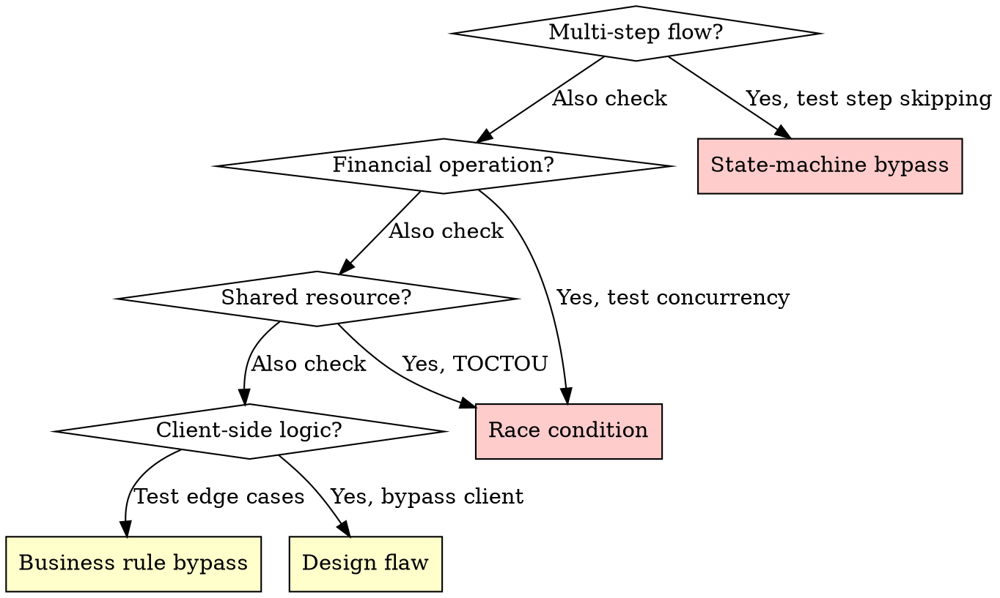

# Business Logic Domain

## Overview

Business logic flaws are the hardest to find and the hardest to fix. 1,679 WooYun cases prove that when the state machine is wrong, every feature built on top of it inherits the flaw.

**Core principle:** Every multi-step business process is a state machine. If a state can be reached without satisfying its prerequisites, the state machine is broken.

## Attack-Pattern Matrix

### State-Machine Bypass (1,391 cases, 65.3% high severity)

**Basic testing:**

```
For every multi-step flow:

1. Map the expected state sequence
   Step 1 (prerequisite: none) -> Step 2 (prerequisite: Step 1 complete) -> Step 3 ...

2. Test each step independently
   - Can Step 3 be reached without completing Step 2?
   - Can the flow return to Step 1 after Step 3 is complete?
   - Can Step 2 be repeated multiple times?
   - Can data submitted in Step 1 be modified at Step 3?

3. Identify the enforcement mechanism
   - Client-side JavaScript flow? (bypass: request the Step N endpoint directly)
   - Session-based state? (bypass: manipulate session, use a different session)
   - Token-based state? (bypass: predict/reuse token)
   - Server-side state machine? (test: edge cases in transition logic)
```

**Common vulnerable flows:**

| Business flow | Expected steps | Bypass attack |
|---------------|----------------|---------------|
| Registration | Email -> verification -> profile -> activation | Skip verification and access profile directly |
| Purchase | Cart -> address -> payment -> confirmation | Skip payment and confirm directly |
| Password reset | Request -> verification code -> new password | Skip code verification and set password directly |
| KYC verification | Submit documents -> review -> approval | Change status from "submitted" to "approved" |
| Refund | Request -> review -> approval -> payment | Skip review and trigger payment directly |

### Race Condition / TOCTOU (266 cases, 74.8% high severity)

**Time-of-check to time-of-use flaws in business logic:**

```
Pattern:
  Thread A: check balance(100) -> sufficient -> debit(100) -> balance = 0
  Thread B: check balance(100) -> sufficient -> debit(100) -> balance = -100

  Result: 200 was withdrawn from a balance of 100
```

**Testing method:**

```
1. Identify operations with a check-then-act pattern
   - Balance check -> withdrawal
   - Inventory check -> purchase
   - Coupon validity check -> apply coupon
   - Referral check -> reward points

2. Prepare race-condition testing
   - Capture the complete request
   - Set up N concurrent identical requests (N = 5-20)
   - Tools: Burp Turbo Intruder, Python threads, curl run in the background with &

3. Execute
   - Send all N requests simultaneously
   - Observe: how many succeeded?
   - Expected: only 1 should succeed
   - Vulnerable: multiple succeeded

4. Validate
   - Check final state (balance, inventory, coupon use count)
   - Calculate: is the check-then-act sequence atomic?
```

### Business Rule Bypass (266+22 cases)

**Patterns that exploit assumptions in business rules:**

| Pattern | Example | Test |
|---------|---------|------|
| Negative value injection | Transfer -100 from A to B = steal from B | Submit negative values in all financial fields |
| Boundary condition | 0.001 x 10000 = rounding exploit | Extremely small/large values |
| Type confusion | string "0" vs integer 0 vs boolean false | Submit different types for amount fields |
| Referral abuse | Self-referral: create account, refer yourself | Register using your own account's referral code |
| Time-based bypass | Use service between renewal and expiry checks | Access feature during payment grace period |
| Multi-channel inconsistency | Web validates, mobile API does not | Perform the same operation through different clients |
| Partial operation | Complete half of an atomic operation | Cancel transfer mid-flow and check whether source was debited but target not credited |

### Design Flaw as Attack Surface (1,391 cases)

**Structural patterns in the WooYun "design flaw" category:**

```
1. Client trust
   - Server trusts client-supplied price, role, user_id, privilege level
   - Test: modify every parameter that affects business logic

2. Implicit authorization
   - "If the user reached this page, they must be authorized"
   - Test: direct URL access and API calls outside the UI workflow

3. Inconsistent validation
   - Frontend validates, backend does not
   - Test: bypass frontend (curl, Burp), submit directly to API

4. Predictable tokens/IDs
   - Sequential order IDs, timestamp-based tokens
   - Test: analyze pattern and predict next value

5. Missing atomicity
   - Multi-step operation not wrapped in a transaction
   - Test: interrupt operation and inspect partial state
```

## Decision Flowchart: Which Logic Flaw?



## Real Cases

| Case | Subdomain | Impact |
|------|-----------|--------|
| Baihe.com app design flaw affected 1M+ women's phone numbers | Design flaw | 1M+ phone numbers leaked |
| 114 Ticketing site logic flaw exploited payment timeout and leaked sensitive information for tens of thousands of users | State machine | 10K+ users, including orders, names, IDs, and train routes |
| Zealer Android client chain from unpacking to Burp auto encryption/decryption plugin, SQL injection, and logic flaw | Design flaw | Full mobile application attack chain |
| Super Curriculum Schedule core business logic flaw leaked every user's real name, phone, and QQ | Business rule | All users' real names + phones + QQ numbers |
| Datebao official site business logic flaw allowed free or heavily discounted insurance purchases | Business rule | Free/discounted insurance purchases |
| Hongxin Securities design flaw | Design flaw | Securities system flaw |
| Lizi Beauty severe logic flaw | Business rule | E-commerce logic bypass |

## Defense Patterns

### Code Level
- **Server-side state machine:** enforce valid transitions with an explicit finite-state machine
- **Atomic operations:** database transactions with appropriate isolation levels
- **Optimistic locking:** version field on records; reject stale updates
- **Idempotency:** unique request ID; reject duplicate operations
- **Input validation:** server-side, type-safe, range-checked

### Architecture Level
- **Distributed locks:** Redis/Zookeeper for concurrent access control
- **Event sourcing:** immutable audit trail for all state transitions
- **Saga pattern:** compensating transactions for distributed operations
- **Circuit breaker:** prevent cascading failure across multi-service flows

### Monitoring
- **State-transition anomalies:** orders reaching invalid states
- **Concurrent operation spikes:** multiple identical requests within milliseconds
- **Value anomalies:** negative numbers, zero prices, extreme quantities
- **Cross-channel inconsistency:** different clients produce different outcomes for the same operation
